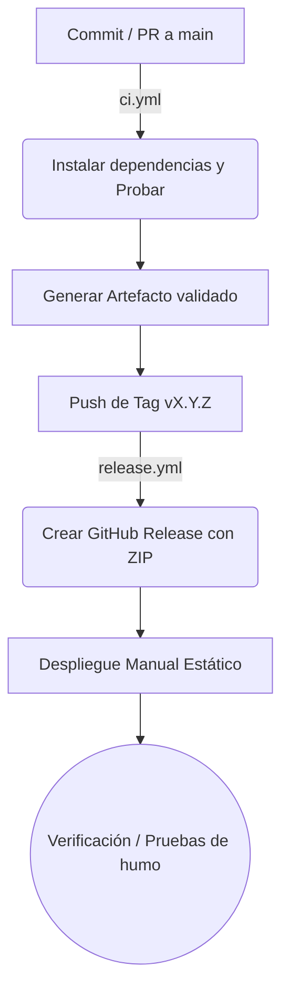

# Pipeline CI/CD

## Integración Continua (ci.yml)
Se ejecuta automáticamente al realizar pushes o PRs hacia la rama `main`.
1. Preparación del entorno (Node.js 20).
2. Instalación de dependencias (`npm ci`).
3. Ejecución de pruebas unitarias (`npm test -- --watch=false --browsers=ChromeHeadless`).
4. Compilación para producción (`npm run build -- --configuration production`).

## Liberación (release.yml)
Se ejecuta exclusivamente cuando se crea y hace push de un tag con formato `v*.*.*`.
1. Preparación del entorno (Node.js).
2. Instalación de dependencias.
3. Compilación para producción (`npm run build`).
4. Empaquetado en un archivo ZIP.
5. Creación automática de un "GitHub Release" empaquetando el archivo ZIP y las notas de lanzamiento usando `gh release create`.

## Diagrama del Flujo

## Puertas de Calidad
- Pruebas unitarias deben pasar para permitir integración.
- Proceso de CI exitoso es prerrequisito para un merge.

## Riesgos
Defecto conocido (reportado por el equipo): en main, package.json declara @angular/cdk y @angular/material en ^22.0.2 junto con Angular 17.3, versiones no compatibles entre sí; el CI del frontend puede fallar en la instalación o compilación hasta alinear las dependencias a 17.x. La corrección se hará en un PR aparte, con acuerdo del equipo.

## DevSecOps
- Se recomienda implementar y configurar **Dependabot** (ecosistemas: npm, github-actions) y **Secret Scanning** de GitHub. (Configuración manual pendiente).

## Métricas DORA

| Métrica | Definición | Cómo se mide | Estado Actual |
|---|---|---|---|
| **Frecuencia de Despliegue** | Frecuencia de envíos a producción | Historial de despliegues/tags | Por medir |
| **Tiempo de Entrega (Lead Time)** | Tiempo desde commit hasta despliegue | Tiempos de CI/CD | Por medir |
| **Tasa de Fallos (CFR)** | Porcentaje de liberaciones que fallan | Tracking de Hotfixes post-despliegue | Por medir |
| **Tiempo de Recuperación (MTTR)** | Tiempo en recuperar tras falla | Tiempos de rollbacks | Por medir |
