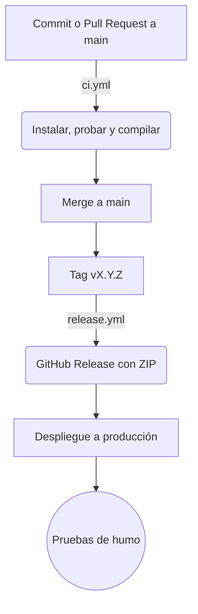

# Pipeline CI/CD (Frontend)

## Integración continua (`ci.yml`)
Se ejecuta en cada push y Pull Request hacia `main`:
1. Preparación del entorno (Node.js 20).
2. Instalación de dependencias (`npm ci`). El archivo `.npmrc` con `legacy-peer-deps=true` resuelve el conflicto de dependencias entre Angular 17 y Angular Material 22.
3. Pruebas unitarias (`npm test -- --watch=false --browsers=ChromeHeadless`).
4. Compilación para producción (`npm run build -- --configuration production`).

## Liberación (`release.yml`)
Se ejecuta únicamente al subir un tag con formato `vX.Y.Z`:
1. Preparación del entorno e instalación de dependencias.
2. Pruebas unitarias y compilación para producción.
3. Empaquetado de `dist/` en un archivo `.zip`.
4. Creación del GitHub Release con el `.zip` y las notas generadas, con `gh release create`.

El workflow no despliega a ningún servidor ni usa secretos propios: solo el token automático de GitHub para publicar el Release.

## Diagrama del flujo

## Puertas de calidad
- Las pruebas unitarias deben pasar.
- Con la protección de `main` activa, un Pull Request no se fusiona si el CI falla.

## Riesgo conocido
Angular Material y CDK 22 con Angular 17.3 generan un conflicto de dependencias par. Se resolvió con `.npmrc` (ver `PLAN_Y_CASOS_DE_PRUEBA.md`). Alinear las versiones queda como mejora, con revisión visual previa.

## DevSecOps (mejoras futuras)
- Activar Dependabot (npm y github-actions) y Secret Scanning de GitHub.
- Revisar las vulnerabilidades que reporta `npm audit` sin aplicar `npm audit fix` a ciegas, porque puede cambiar versiones y romper la aplicación.

## Métricas DORA

| Métrica | Definición | Cómo se mide | Estado actual |
|---|---|---|---|
| Frecuencia de despliegue | Frecuencia de envíos a producción | Historial de tags y Releases | Por medir |
| Tiempo de entrega | Tiempo desde el commit hasta el despliegue | Tiempos de CI/CD | Por medir |
| Tasa de fallos | Porcentaje de liberaciones que fallan | Hotfixes posteriores al despliegue | Por medir |
| Tiempo de recuperación | Tiempo en recuperarse tras una falla | Tiempos de rollback | Por 
