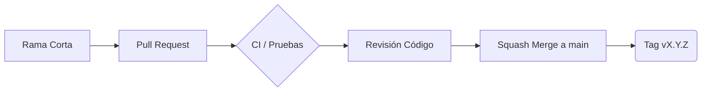

# Flujo de Versiones

## Metodología
Utilizamos **GitHub Flow** porque es ágil, adecuado para despliegues continuos y mantiene una rama `main` siempre estable.

## Convención de Ramas
- `main`: Rama estable y productiva.
- `feature/*`: Nuevas características.
- `fix/*` o `hotfix/*`: Correcciones.
- `docs/*`, `test/*`, `ci/*`: Documentación, pruebas y CI/CD.

## Mensajes de Commit
Utilizamos **Conventional Commits**. Ejemplo: `feat(ui): rediseño del dashboard`.

## Proceso de Pull Request y Revisión
1. Se abre un PR hacia `main`.
2. Se ejecuta la validación automatizada (CI en verde requerida).
3. Revisión y aprobación (1 requerido).
4. Fusión a través de "Squash and Merge".

*Nota: Las reglas de protección recomendadas para main (PR obligatorio, 1 aprobación, CI requerida, sin force push, ramas actualizadas) son **configuración manual pendiente en GitHub, requiere acuerdo del equipo**.*

## Versionado Semántico y Hotfixes
Utilizamos **SemVer** con tags `vX.Y.Z`.
- Los **hotfixes** nacen como rama desde el tag de producción afectado o desde `main` (según se defina), y se integran mediante PR de vuelta a `main` para luego crear un nuevo tag.

## Resolución de conflictos
Se realiza resolviendo los conflictos localmente mediante rebase de `main` hacia la rama actual, probando y actualizando el PR.

## Ramas actuales del repositorio
- `main`
- `docs/plan-flujo-liberacion-cicd`

*(Se migrarán gradualmente a la convención establecida).*
