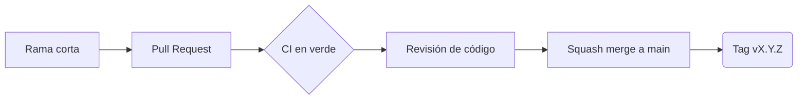

# Flujo de Versiones

## Metodología
Se usa **GitHub Flow**: es ágil, funciona bien con integración continua y mantiene la rama `main` estable.

## Convención de ramas
- `main`: rama estable.
- `feature/*`: nuevas características.
- `fix/*` o `hotfix/*`: correcciones.
- `docs/*`, `test/*`, `ci/*`: documentación, pruebas y CI/CD.

## Mensajes de commit
Se usa **Conventional Commits**. Ejemplo: `feat(ui): rediseño del dashboard`.

## Proceso de Pull Request y revisión
1. Se abre un Pull Request hacia `main` con la plantilla del repositorio.
2. Se ejecuta el CI automáticamente y debe quedar en verde.
3. Otro integrante revisa y aprueba (1 aprobación requerida).
4. Se fusiona con "Squash and merge" y se borra la rama.

> Las reglas de protección de `main` (Pull Request obligatorio, 1 aprobación, CI requerido y sin force push) se configuran en GitHub, en Settings, Rules.

## Versionado semántico y hotfixes
Se usa **SemVer** con tags `vX.Y.Z`. Un hotfix nace desde `main`, se integra mediante Pull Request y genera un nuevo tag PATCH.

## Resolución de conflictos
Se resuelven en local actualizando la rama con los cambios de `main` (merge o rebase), se prueba y se actualiza el Pull Request.

## Ramas del repositorio
Además de `main`, existen ramas personales de los integrantes, creadas en la etapa inicial del proyecto. Se conservan como historial; el trabajo nuevo usa las ramas de la convención anterior.
